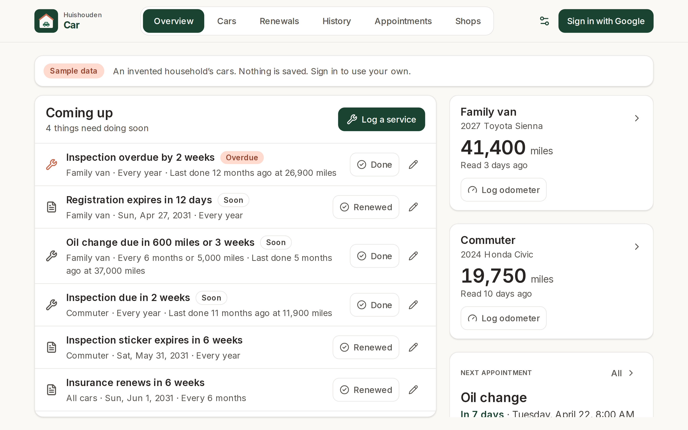
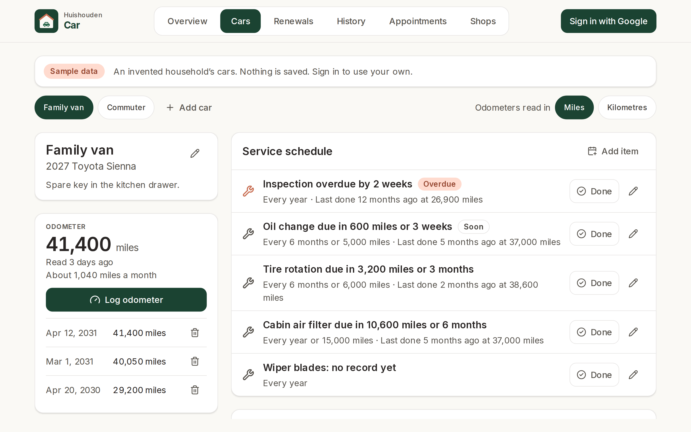
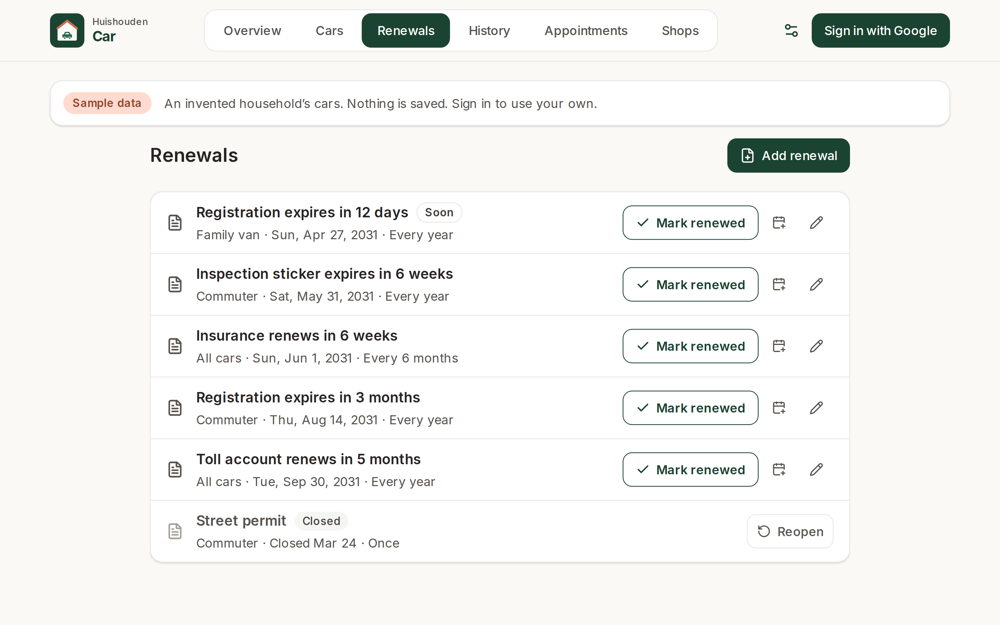
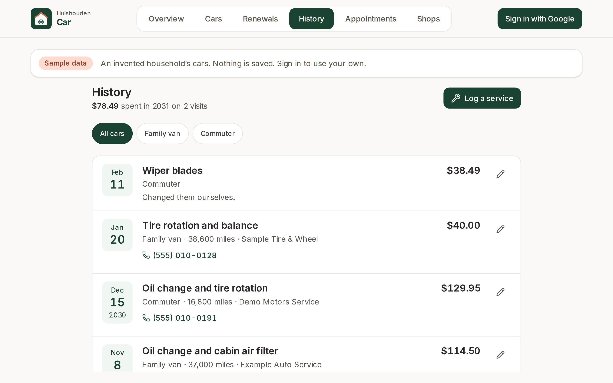
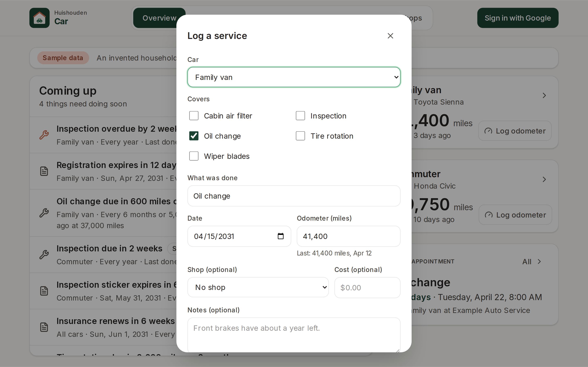
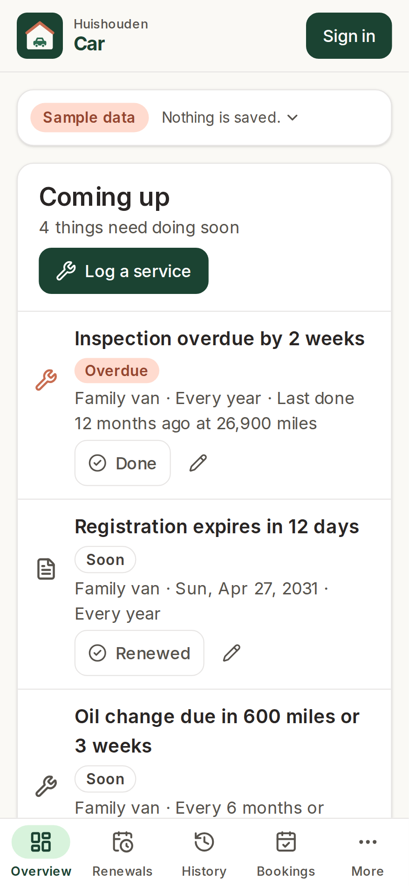
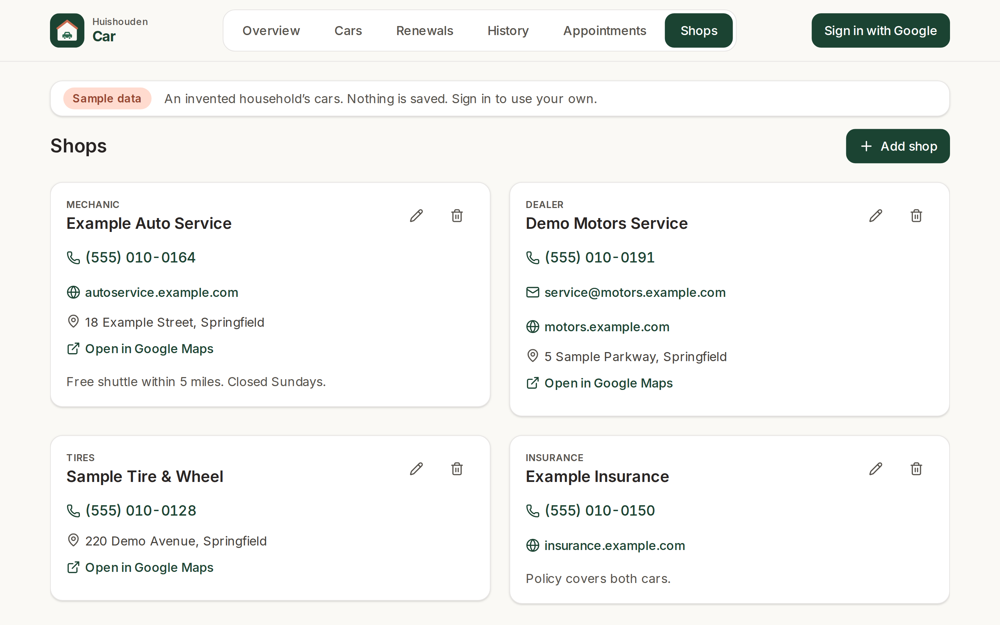
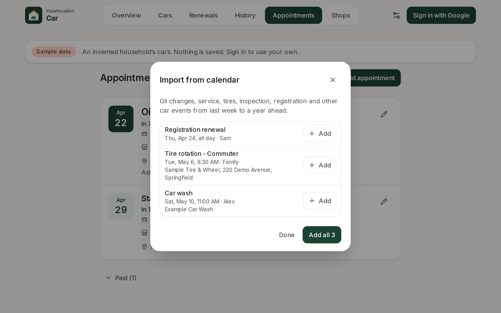

# Huishouden Car

A wall-tablet app for the household's cars. For each car it keeps a service schedule by time and
mileage (oil change every 6 months or 5,000 miles, tire rotation, inspection, wiper blades), the
odometer readings, renewals with due dates (registration, insurance, the inspection sticker, a toll
account), the service history with what each visit cost, and the shops, each one tap from a call or
a map. The overview reads from across the room: "Oil change due in 600 miles or 3 weeks",
"Registration expires in 12 days", overdue items first.

Something is due at whichever comes first: the months since it was last done, or the miles since,
measured against the latest odometer reading. With a year of readings the app also estimates when the
miles will run out ("Tire rotation due in 4,550 miles (about 6 months)").

Live at https://huishouden-car.web.app, also linked from the [Huishouden portal](https://huishouden-piekstra.web.app).
Installable on the tablet, phones and laptops, and works offline (entries sync when the connection is back).

## Screenshots

| Overview | A car |
|---|---|
|  |  |

| Renewals | History |
|---|---|
|  |  |

| Log a service | Phone |
|---|---|
|  |  |

| Shops | Import from calendar |
|---|---|
|  |  |

_Screenshots of the live site signed out, which shows an invented household's two cars dated in 2031. Refreshed by CI after each deploy._

## Data

Signed-in members of a Huishouden household read and write under `households/{householdId}`:

| Collection | Fields |
|---|---|
| `carVehicles` | `name` (nickname), `make`, `model`, `year`, `notes`, `createdAt`, `updatedAt`, `by` |
| `carServiceItems` | `vehicleId`, `name`, `everyMonths`, `everyDistance`, `lastDate`, `lastOdometer`, `notes`, `createdAt`, `updatedAt`, `by` |
| `carOdometer` | `vehicleId`, `date`, `reading`, `note`, `createdAt`, `updatedAt`, `by` |
| `carRenewals` | `vehicleId` (absent: every car), `kind` (`registration`, `insurance`, `inspection`, `toll`, `other`), `name`, `dueDate`, `everyMonths`, `notes`, `createdAt`, `updatedAt`, `by` |
| `carServiceLog` | `vehicleId`, `date`, `odometer`, `what`, `serviceItemIds`, `shopId`, `costCents`, `notes`, `createdAt`, `updatedAt`, `by` |
| `carAppointments` | `vehicleId`, `title`, `at`, `location`, `notes`, `shopId`, `calendarEventId`, `calendarLink`, `createdAt`, `updatedAt`, `by` |
| `carSettings/main` | `distanceUnit` (`mi` or `km`), `updatedAt`, `updatedBy` |

Dates are local calendar days (`YYYY-MM-DD`), distances whole numbers in the household's unit (stored
as entered; switching the unit relabels, it does not convert), costs whole cents. No plates or VINs.
Shops live in the household-wide `contacts` collection shared by every app
(`@huishouden/pwa-kit/contacts`); Car shows those whose `apps` include `car`. The Firestore rules live
in [huishouden/rules](https://github.com/huishouden/rules), which owns the project's rules file. Signing
in uses Google with no extra scopes; the household comes from the shared `households` document, so one
invite from the portal opens every Huishouden app.

Car publishes its dates to the household agenda (`households/{id}/agenda`, app `car`, through
`@huishouden/pwa-kit/agenda`) for the portal's calendar and Today view: each service item's next due
day (`due`; mileage-only items when the recent pace gives an estimated day), every renewal
(`renewal`) and every appointment (`appointment`, with the shop's name). Saves replace the changed
records' items; opening the app reconciles them all. The signed-out sample never writes.

Find in my calendar and Import from calendar read Google Calendar (read-only) through
`@huishouden/pwa-kit/calendar`; Google asks once for permission the first time. Find a business looks
places up on OpenStreetMap (`@huishouden/pwa-kit/places`), only when Search is pressed.

## Privacy

Household data lives in the household's own Firestore documents, visible only to its members.
To catch problems early, the app sends reports to New Relic (free tier) through
`@huishouden/pwa-kit/observability`: errors (emails, ids, query strings and long numbers removed),
Core Web Vitals and page loads, the app version, device type, and the country and region New Relic
derives from the request; and anonymous usage counts per visit: `log service`, `log odometer`, `mark renewed`, `save vehicle`, and which tab is open. Households are counted by a
hash of the id. No names, emails, entries, free text or precise location, and no cookie or stored
id: nothing links one visit to the next. When the browser sends Global Privacy Control or Do Not
Track, usage counts are skipped; errors and speed still go. Builds without the `VITE_NEWRELIC_*`
repo variables (local, staging) send nothing. The page people see is
[huishouden-piekstra.web.app/privacy](https://huishouden-piekstra.web.app/privacy); details in pwa-kit
[docs/observability.md](https://github.com/huishouden/pwa-kit/blob/main/docs/observability.md).

## Develop

```sh
bun install          # also enables the pre-commit leak scan
bun run env:pull     # writes .env.local from the repo's VITE_* variables
bun run dev          # http://localhost:3004
bun run lint && bun run test && bunx pwa-design-check && bun run build
bun run e2e          # Playwright smoke and sample-data feature tests against the live site (BASE_URL to override)
bun run screenshots  # README screenshots (SCREENSHOT_DIR to override)
bun run icons        # regenerate the logo and PNG icons
```

The due-date logic is pure and tested in `src/lib` (`schedule.ts`, `renewals.ts`, `odometer.ts`,
`upcoming.ts`), with inputs and expected wording in `src/lib/__fixtures__`.

Built on [huishouden-pwa-kit](https://github.com/huishouden/pwa-kit) and follows its
[design language](https://github.com/huishouden/pwa-kit/blob/main/DESIGN.md) and
[standard](https://github.com/huishouden/pwa-kit/blob/main/STANDARD.md). Pushes to `main` deploy to
Firebase Hosting (project `huishouden-piekstra`, site `huishouden-car`), then run the smoke tests and refresh the screenshots.
